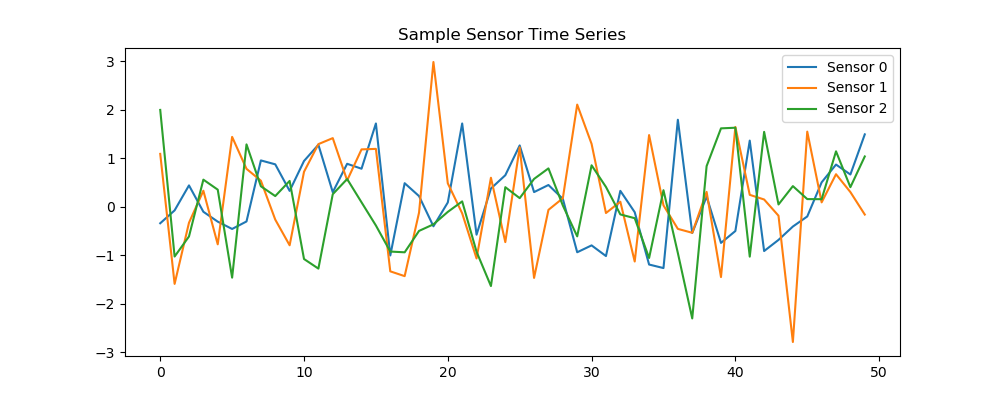

# Edge-Ready-Time-series-ML-pipeline
A demo of an end-to-end pipeline for time-series sensor data analysis:

## Project OverView
´
* Synthetic data generation, cleaning, normalization, outlier removal

* Feature engineering: rolling statistics + FFT

* Classical ML + Neural Networks (1D-CNN & LSTM)

* Edge deployment via TFLite & ONNX with quantization (light models)

* Visualization of data and model predictions 

* Optional FastAPI for hybrid edge-cloud simulation (Future steps)

The File structure would be 

```plaintext
edge_sensor_pipeline/
├── data/                        
├── notebooks/                   # Jupyter notebooks for EDA
├── src/
│   ├── data_ingestion.py        # Generate/load sensor data
│   ├── preprocessing.py         # Cleaning, normalization, outlier removal
│   ├── feature_engineering.py   # Rolling stats, FFT features
│   ├── train_classical.py       # Classical ML models 
│   ├── train_nn.py              # 1D-CNN & LSTM training
│   ├── deploy.py                # TFLite/ONNX conversion, quantization
│   ├── visualize.py             # Matplotlib dashboards
│   └── utils.py                 # Helper functions
├── docker/                      # Dockerfile 
├── requirements.txt             # Python dependencies
├── README.md                    # Project overview, instructions
└── main.py                      # Run full pipeline end-to-end
```


For running locally:
```python
python main.py
```

The [tflite model](edge_model.tflite) is saved and the results are visualized 


